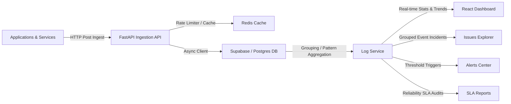

# AD. Sentry - Centralized Observability & Reporting Platform

## Overview

**AD. Sentry** is a production-ready centralized logging, observability, and reporting platform designed to transform raw application events into actionable operational insights. 

The platform receives logs through a rate-limited, asynchronous HTTP ingestion API, persists all events as immutable records, automatically groups related log traces into high-level logical issues, monitors ingestion trends, and generates stability reports that outline system health and service SLA metrics.



Collect. Categorize. Observe. Report.

---

## Tech Stack

### Backend
- **Python 3.12+**
- **FastAPI** (Asynchronous route handlers and CORS validation)
- **SQLAlchemy 2.0 (Async)** & **Supabase/PostgreSQL** (Immutable event persistence)
- **Redis** (Used for window-based request rate-limiting and route metadata caching)
- **uv** (Fast package management)
- **Pytest & HTTPX** (Async integrations and API endpoint testing)

### Frontend
- **React 18** with **Vite** and **TypeScript**
- **React Router Dom v6** (Asynchronous and lazy route rendering)
- **Lucide React** (Consistent UI iconography)
- **Custom CSS Theme Tokens** (Adaptive light/dark mode system)

---

## Architecture & Layer Responsibilities

The codebase enforces a strict **Domain-Driven Design (DDD)** structure to decouple framework adapters from business rules.

### Backend Structure (`app/src/`)
- **Router Layer (`app/src/logs/router.py`)**: Thin FastAPI boundary handles request validation (Pydantic schemas) and HTTP responses.
- **Service Layer (`app/src/logs/service.py`)**: Implements business rules (rate limits, trend aggregation, issue regex signatures, report compiling).
- **Model Layer (`app/src/logs/models.py`)**: Defines ORM and schema properties.
- **Database Client (`app/src/database.py`)**: Asynchronous database session engine. Falls back to a local `MockSupabaseClient` for sandboxed development when live credentials are empty or offline.
- **Rate Limiter (`app/src/shared/rate_limiter.py`)**: Redis-backed rate limiter targeting route templates to prevent dynamic URL rate fragmentation.

### Frontend Structure (`client/src/`)
- **API Wrapper (`client/src/lib/api.ts`)**: Direct HTTP request bindings mapped to model payloads.
- **Layout Shell (`client/src/components/Layout.tsx`)**: Global page shell containing the navigation menu, application info, and live Light/Dark mode state toggle.
- **Pages (`client/src/pages/`)**:
  - `Dashboard`: Interactive stats grid, 24h trend graph (custom SVG area rendering), and active service health meters.
  - `Logs Explorer`: High-performance log query grid with level badges, parent-child span trace viewer, and simulated ingest tool.
  - `Issues Explorer`: Grouped errors showing event frequencies, first/last seen metrics, assignees, and resolution controls.
  - `Alerts Portal`: Rules configuration (Slack/Email trigger thresholds) and active alert status management.
  - `Reports Portal`: Daily/Weekly SLA reports displaying overall MTTR, uptime tables, and operational audit logs.

---

## Setup & Running Locally

### Prerequisites
- Docker & Docker Compose
- Node.js 18+ & npm
- Python 3.12+ (managed with `uv`)

### 1. Ingesting & Running Infrastructure
Start Redis and PostgreSQL/Supabase services via Docker Compose:
```bash
docker compose up -d
```

### 2. Backend Server Setup
From the project root:
1. Create a virtual environment and sync dependencies:
   ```bash
   uv venv
   source .venv/bin/activate
   uv sync
   ```
2. Create `app/.env` (configured automatically to point to Redis on `localhost:6379`).
3. Run the FastAPI development server:
   ```bash
   uv run uvicorn app.src.main:app --reload --host 127.0.0.1 --port 8000
   ```

### 3. Frontend Client Setup
From the `client/` subdirectory:
1. Install node dependencies:
   ```bash
   npm install
   ```
2. Start the Vite development server:
   ```bash
   npm run dev -- --host 127.0.0.1
   ```
3. Open `http://127.0.0.1:5173/` in your browser.

---

## API Documentation

The FastAPI backend exposes the following RESTful endpoints:

### Ingestion & Querying
- `POST /v1/logs` - Ingests a new log payload. Validates payload structure and applies rate limiting.
- `GET /v1/logs` - Returns paginated, filterable raw log lines. Supports sorting, service filters, and level filtering.
- `GET /v1/logs/{log_id}` - Retreives a specific log instance including its span traces.

### Analytics & Observability
- `GET /v1/logs/stats` - Pulls overall count aggregates, active counts by service/environment, and error percentage rates.
- `GET /v1/logs/trends` - Provides hourly time-series aggregation bucketed over the last 24 hours.
- `GET /v1/logs/issues` - Returns grouped issue lists aggregated by common message signatures.
- `GET /v1/logs/alerts` - Retrieves triggered active warnings matching alerting thresholds.
- `GET /v1/logs/reports` - Compiles system SLA stability audits.

---

## Running Tests

Pytest test suites are located in `app/tests/` and cover rate limiting, service endpoints, and mock database integration.

To run tests:
```bash
PYTHONPATH=. pytest app/tests/
```
