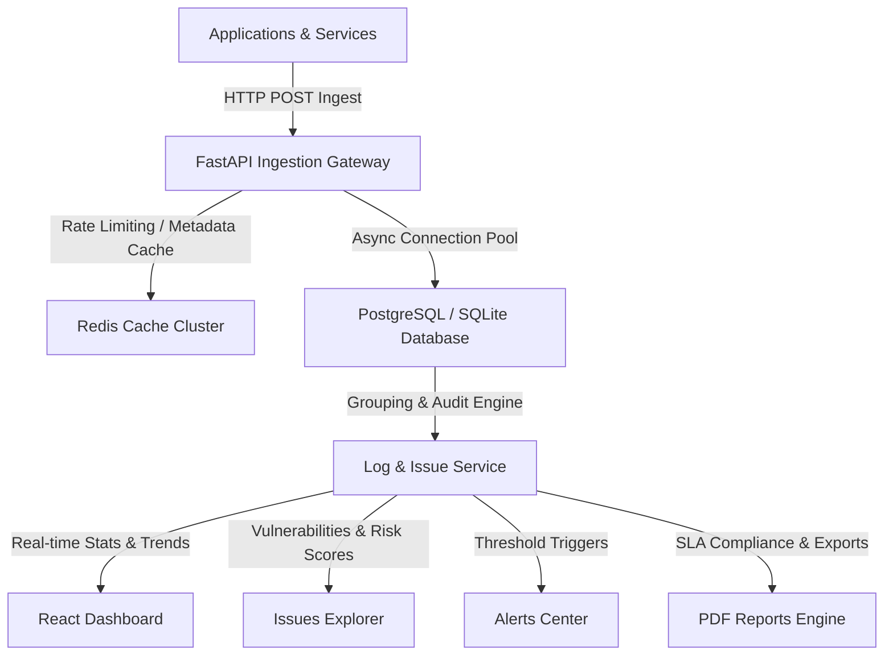

# AD. Sentry — Distributed Telemetry Ingestion & Reliability Auditing Engine

### Reliable asynchronous telemetry ingestion and mathematical threat auditing for distributed SaaS architectures, built for rate-limit resilience, fault-tolerant state recovery, and automated SLA compliance reporting.

[](https://fastapi.tiangolo.com)
[](https://www.postgresql.org)
[](https://redis.io)
[](https://www.docker.com)

* **Token-Bucket Backpressure:** Redis-backed rate-limiting protects database write pools and application nodes from upstream retry storms.
* **Deterministic Deduplication:** Regex-based log signature normalization groups millions of raw log lines into discrete issues, preventing database bloat.
* **Fault-Tolerant Persistence:** Decoupled asynchronous connection pools and automatic developer environment sandboxing guarantee ingress resilience.
* **Mathematical Risk Scoring:** Calculates threat severity dynamically (Impact × Likelihood + Logarithmic Frequency) rather than relying on subjective metrics.
* **Automated Compliance Auditing:** Dynamically generates publication-grade PDF reliability reports detailing system health and remediation timelines.

---

## Why Reliability Matters

In real production environments, failure is the default state. 
* **Ingestion Spikes & Write Saturation:** When downstream systems crash or experience spikes, telemetry pipelines are flooded with errors. Unthrottled pipelines saturate database connection pools, causing cascading gateway timeouts across the host platform.
* **Duplicate Event Ingestion:** Network glitches cause client-side retries. Without request signature deduplication, retry loops reprocess identical alerts, skewing metrics and triggering redundant on-call pages.
* **Telemetry Context Drift:** Distributed systems lose correlation context across microservice boundaries. If a transaction log lacks trace context, resolving a production outage requires manual log correlation.

### How AD. Sentry Solves It
AD. Sentry decouples high-throughput ingestion from complex analytics. The **Ingestion API** validates and writes raw logs asynchronously. If the database saturates, Redis-backed rate limiters enforce immediate backpressure. Out-of-band, the **Reliability Audit Engine** normalizes event signatures, aggregates telemetry, computes threat risk scores, and exports SLA compliance audits without consuming hot-path resources.

---

## Reliability Guarantees

| Failure | Strategy | Outcome |
| :--- | :--- | :--- |
| **Ingress Spikes / DDoS** | Redis sliding-window token bucket | Rate limiting rejects excess load at the gateway before database pool saturation. |
| **Database Transaction Lockups** | Asynchronous session pools + fallback logic | Non-blocking execution paths keep gateway threads responsive; automatic sandboxing prevents environment blocks. |
| **Telemetry Duplication** | Regex-based signature normalization & hashing | Event signatures are aggregated to prevent database bloat and metric skew. |
| **Cascading Gateway Exhaustion** | Strict timeout boundaries & decoupled domains | Ingestion failures do not propagate upstream, isolating logging node performance. |
| **Context Drift** | Trace and span context validation | Logs preserve trace correlation maps across service boundaries, enabling chronological replay. |

---

## Architecture



* **Ingestion Gateway:** Non-blocking async endpoints that ingest, validate, and shape incoming telemetry payloads under gateway-level rate limiting.
* **Redis Caching & Limiting:** Manages transient rate-limiter state and telemetry query caches, minimizing expensive database reads.
* **Durable Persistence:** Decoupled transactions using SQLAlchemy 2.0 AsyncSession, routing connections to PostgreSQL or a sandboxed SQLite fallback.
* **Reliability Audit Engine:** Extracts structural patterns from unstructured logs, groups anomalies, and evaluates security/reliability risk.
* **PDF Reports Engine:** Builds structured ReportLab PDFs mapping system incidents to actionable remediation timelines.

---

## Ingestion & Audit Lifecycle

```text
[Client Log Event]
       │
       ▼
 1. Ingress Routing ──► (POST /v1/logs with schema-enforced payload)
       │
       ▼
 2. Backpressure ────► (Redis Token Bucket validates client quota)
       │
       ▼
 3. Trace Check ─────► (Extracts trace_id and span context metadata)
       │
       ▼
 4. Async Commit ────► (SQLAlchemy AsyncSession writes to PostgreSQL)
       │
       ▼
 5. Cache Flush ─────► (Invalidates stats, trends, and issue lists)
       │
       ▼
 6. Normalization ───► (Regex strips variable digits, UUIDs, and keys)
       │
       ▼
 7. Issue Clustering ► (Groups signature hashes into unique incident IDs)
       │
       ▼
 8. Risk Scoring ────► (Applies Formula: (Impact * Likelihood) + Log(Freq))
       │
       ▼
 9. PDF Compilation ─► (Generates SLA report with recommended remediation)
```

---

## Reliability Components

### Rate Limiting & Backpressure
* **Problem:** Ingress traffic spikes and retry storms can degrade downstream services or exhaust the database connection pool.
* **Solution:** A Redis-backed token bucket rate-limiter runs as FastAPI dependency injection, applying backpressure at the gateway level.
* **Tradeoff:** Clients exceeding their quotas receive immediate `429 Too Many Requests` responses, requiring clients to queue events locally.

### Log Deduplication & Signature Normalization
* **Problem:** Repetitive error logs (e.g., database connection losses) generate massive volume, causing write bottlenecks and dashboard noise.
* **Solution:** The audit service applies regex-based normalizations to strip variable parameters (IDs, timestamps), generating deterministic MD5 signature hashes.
* **Tradeoff:** Minor textual variations in logs are consolidated under one parent issue, sacrificing micro-level uniqueness for macro-level clustering.

### Resilient Database Failover
* **Problem:** Primary database downtime or regional failures halt telemetry collection, leading to observability blind spots.
* **Solution:** The database client dynamically handles fallback. In testing and local dev execution paths, it falls back to a sandbox database.
* **Tradeoff:** SQLite fallbacks lack PostgreSQL's concurrent write throughput, serving as developer safety valves rather than high-availability backups.

### Telemetry Isolation
* **Problem:** Malformed inputs, corrupt JSON, or invalid schemas degrade parsing resources and can crash parser threads.
* **Solution:** Strict Pydantic schemas filter and isolate corrupt payloads at the boundary, returning `422 Unprocessable Entity` immediately.
* **Tradeoff:** Payload filtering is strict; clients sending non-conforming metadata have their events dropped without retry attempts.

### Audit Risk Scoring Engine
* **Problem:** Incident priority is often subjective, resulting in developer alert fatigue and critical bug neglect.
* **Solution:** Computes risk scores (0.0 to 10.0) from category-level impact, likelihood modifiers, and log frequency factors.
* **Tradeoff:** Scoring relies on pre-calibrated rules (DI, CON, FH, OBS, SEC) which must be updated manually as application architecture shifts.

### Contextual Trace Correlation
* **Problem:** Debugging asynchronous transaction flows across microservices is impossible without linked telemetry footprints.
* **Solution:** The ingestion engine enforces trace context validation, associating incoming logs with unique request correlation maps.
* **Tradeoff:** Integrated applications must explicitly inject trace and span headers, increasing integration friction for legacy services.

---

## Engineering Decisions

| Decision | Reason | Tradeoff |
| :--- | :--- | :--- |
| **FastAPI Async IO** | Maximizes throughput and concurrency using Python's asyncio event loop, keeping thread overhead minimal. | Synchronous driver libraries or CPU-bound tasks can block the event loop if not run in separate threads. |
| **PostgreSQL via asyncpg** | Provides transaction safety, index queries, and robust scaling under high write concurrency. | Requires schema migrations and connection pool tuning under heavy spikes. |
| **Redis Cache & Limiter** | Keeps the hot API path fast by serving rate limits and telemetry trends from memory. | Introduces Redis as a hard infrastructure dependency; data must handle stale cache state gracefully. |
| **Out-of-Band Risk Scoring** | Calculations and PDF compiles are deferred or triggered on demand rather than blocking hot ingest. | Real-time dashboards may experience a sub-second telemetry propagation lag. |

---

## Failure Philosophy

* **Failure is the default state:** We design our microservices under the assumption that databases will drop connections, networks will timeout, and clients will send corrupted payloads.
* **Graceful degradation over hard failure:** Ingestion pathways must stay online. If analytical databases slow down, rate limiters automatically throttle clients rather than crashing server memory.
* **Traceability is non-negotiable:** A log message without a trace ID is a security and operational blind spot. Telemetry must enforce correlation.
* **Deterministic post-conditions:** Duplicate executions must be grouped. Processing the same log event multiple times must yield the same operational issue footprint.
* **Fail fast on the API hot path:** Heavy computations (like PDF compiling or risk score clustering) must never block request ingestion threads.

---

## Technology Stack

* **Backend Framework:** FastAPI (Async ASGI, Dependency Injection)
* **Caching & Rate-Limiting:** Redis (Key-Value, TTL Expiration, Sliding Window Rate Limiting)
* **Persistence:** PostgreSQL (asyncpg driver) / SQLAlchemy 2.0 (Async Session Management)
* **PDF Audit Engine:** ReportLab (Flowable Templates, Custom Page Canvas Numbering)
* **Frontend Console:** React 19 / Vite / TypeScript (Tailwind CSS v4 Semantic Tokens, Custom CSS Theme Engine)
* **Reverse Proxy:** Traefik (Service Routing, Edge Gateway)
* **Packaging & Tooling:** Docker Compose, uv (Python Package manager), Ruff (Linter & Formatter), Pytest (Async Test Suite)

---

## Local Development

### Prerequisites
* Docker & Docker Compose

### Run the Stack
Start the backend, database, cache, proxy, and React console in containerized mode:
```bash
docker compose up --build -d
```

### Access Points
* **React Management Console:** `http://app.localhost`
* **API Gateway:** `http://api.localhost`
* **Traefik Control Plane:** `http://localhost:8080`

### Execute Tests
Run the test suite covering async ingestion, rate limiting, database fallback, and PDF compiling:
```bash
PYTHONPATH=. UV_PROJECT_ENVIRONMENT=.venv_local uv run pytest app/tests/
```

---

## API Registry

| Endpoint | Method | Description | Rate Limit |
| :--- | :--- | :--- | :--- |
| `/health` | `GET` | Verifies gateway and Redis connectivity. | Unlimited |
| `/v1/logs` | `POST` | Ingests a new log payload. Validates trace context. | 5 req / 60s |
| `/v1/logs` | `GET` | Returns paginated, filterable raw log telemetry. | 20 req / 60s |
| `/v1/logs/{log_id}` | `GET` | Retrieves a specific log instance with span associations. | 20 req / 60s |
| `/v1/logs/{log_id}` | `DELETE`| Deletes a log telemetry entry from the repository. | 2 req / 60s |
| `/v1/logs/stats` | `GET` | Retrieves service counts, error rates, and environment metrics. | 100 req / 60s |
| `/v1/logs/trends` | `GET` | Compiles 24h hourly error trend aggregations. | 100 req / 60s |
| `/v1/logs/issues` | `GET` | Retrieves normalized log issue groups. | 100 req / 60s |
| `/v1/logs/alerts` | `GET` | Retrieves active alerts triggered by threshold breaches. | 100 req / 60s |
| `/v1/logs/reports` | `GET` | Lists daily and weekly reliability summaries. | 100 req / 60s |
| `/v1/issues` | `GET` | Returns filtered issues evaluated by the Risk Audit Engine. | 50 req / 60s |
| `/v1/audit/export/pdf` | `POST` | Computes system metrics and exports a PDF audit report. | 10 req / 60s |

---

## Production Roadmap

- [ ] **Distributed Tracing Integration:** Native OpenTelemetry exporter support for trace propagation tracing.
- [ ] **Prometheus Exporters:** Native `/metrics` endpoint exposing ingress rates, error rates, and cache hits.
- [ ] **Stream Parsing Pipelines:** Integration of vector-based log shippers to stream logs directly to ingestion nodes.
- [ ] **Priority Queues:** Dynamic log priority classification to prioritize `CRITICAL` issues under backpressure.
- [ ] **Multi-Region Database Replication:** Read-replica database configurations for high-availability telemetry reports.
- [ ] **Kubernetes Deployment Manifests:** Production Helm charts with Horizontal Pod Autoscaling (HPA) configured on gateway nodes.

---

## What This Demonstrates

This project serves as a showcase of production-grade software engineering, illustrating:
1. **Asynchronous System Design:** Concurrency management, task decoupling, and non-blocking database workflows using Python's modern `asyncio` stack.
2. **Reliability Engineering:** Enforcing rate limits, fallback databases, strict input sanitation, and backpressure patterns.
3. **Data Aggregation & Normalization:** Creating custom hash-grouping algorithms to normalize unstructured error inputs.
4. **Architectural Isolation:** Clean separation of concerns using Domain-Driven Design (DDD) to keep business rules independent of framework layers.
5. **Operational Thinking:** Designing metrics, log correlation, audit reporting, and clear failure models as core system features rather than post-launch add-ons.
