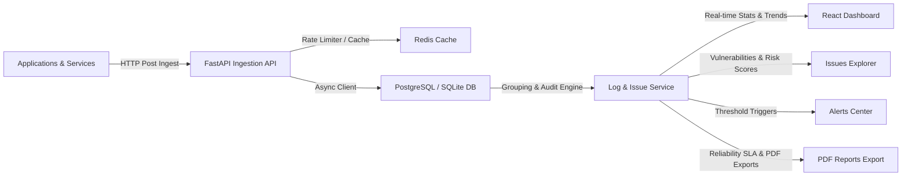

# AD. Sentry - Centralized Observability & Reporting Platform

## Overview

**AD. Sentry** is a production-ready centralized logging, observability, and reliability reporting platform designed to transform raw application events into actionable operational insights. 

The platform receives logs through a rate-limited, asynchronous HTTP ingestion API, persists all events as immutable records, automatically groups related log traces into high-level logical issues, monitors ingestion trends, calculates risk scoring metrics via the **Reliability Audit Engine**, and generates downloadable PDF reports outlining system health and remediation schedules.



Collect. Categorize. Observe. Report.

---

## Tech Stack

### Backend
- **Python 3.12+**
- **FastAPI** (Asynchronous route handlers and CORS validation)
- **SQLAlchemy 2.0 (Async)** with **asyncpg** (PostgreSQL driver) and **aiosqlite** (local testing fallback)
- **Redis** (Used for window-based request rate-limiting and route metadata caching)
- **ReportLab** (Dynamic and structured PDF audit report generation)
- **uv** (Fast package management)
- **Pytest & HTTPX** (Async integrations and API endpoint testing)

### Frontend
- **React 19** with **Vite** and **TypeScript**
- **React Router Dom v6** (Asynchronous and lazy route rendering)
- **Lucide React** (Consistent UI iconography)
- **Custom CSS Theme Tokens** (Adaptive light/dark mode system)

---

## Architecture & Layer Responsibilities

The codebase enforces a strict **Domain-Driven Design (DDD)** structure to decouple framework adapters from business rules.

### Backend Structure (`app/src/`)
- **Logs Domain (`app/src/logs/`)**: Manages raw log ingestion, Redis rate limiting, and database event persistence.
- **Issues Domain (`app/src/issues/`)**: Manages the **Reliability Audit Engine**, calculates issue threat risk scores, and compiles structured PDF audit reports via `ReportLab`.
- **Database Client (`app/src/database.py`)**: Asynchronous database session engine. Connects to PostgreSQL, and automatically falls back to an in-memory `aiosqlite` database for sandboxed local testing.
- **Rate Limiter (`app/src/shared/rate_limiter.py`)**: Redis-backed rate limiter targeting route templates to prevent rate limit fragmentation.

### Frontend Structure (`client/src/`)
- **API Wrapper (`client/src/lib/api.ts`)**: Direct HTTP request bindings mapped to model payloads.
- **Layout Shell (`client/src/components/Layout.tsx`)**: Global page shell containing the navigation menu, application info, and live Light/Dark mode state toggle.
- **Pages (`client/src/pages/`)**:
  - `Dashboard`: Interactive stats grid, 24h trend graph, and active service health meters.
  - `Logs Explorer`: High-performance log query grid with level badges, parent-child span trace viewer, and simulated ingest tool.
  - `Issues Explorer`: Grouped errors showing event frequencies, threat risk scores, and resolution controls.
  - `Alerts Portal`: Rules configuration (Slack/Email trigger thresholds) and active alert status management.
  - `Reports Portal`: Daily/Weekly stability reports and downloadable **PDF Reliability Audits** compiled by the engine.

---

## Setup & Running Locally

### Prerequisites
- Docker & Docker Compose

### Running the Stack
Start the entire infrastructure (React frontend, FastAPI backend, Postgres, Redis, and Traefik reverse proxy) via Docker Compose:

```bash
docker compose up --build -d
```

Once started, the services will be accessible at:
- **React Web Console**: http://app.localhost
- **API Gateway**: http://api.localhost
- **Traefik Control Plane**: http://localhost:8080

---

## API Documentation

The FastAPI backend exposes the following RESTful endpoints:

### Ingestion & Querying
- `POST /v1/logs` - Ingests a new log payload. Validates payload structure and applies rate limiting.
- `GET /v1/logs` - Returns paginated, filterable raw log lines. Supports sorting, service filters, and level filtering.
- `GET /v1/logs/{log_id}` - Retrieves a specific log instance including its span traces.

### Reliability Issues & Audits
- `GET /v1/logs/issues` - Returns grouped issue lists aggregated by common message signatures, including threat-level risk scores.
- `POST /v1/issues/export-pdf` - Evaluates current system health and compiles a downloadable PDF audit report.
- `GET /v1/logs/stats` - Pulls overall count aggregates, active counts by service/environment, and error percentage rates.
- `GET /v1/logs/trends` - Provides hourly time-series aggregation bucketed over the last 24 hours.
- `GET /v1/logs/alerts` - Retrieves triggered active warnings matching alerting thresholds.

---

## Running Tests

Pytest test suites are located in `app/tests/` and cover rate limiting, service endpoints, and mock database integration.

To run tests:
```bash
PYTHONPATH=. UV_PROJECT_ENVIRONMENT=.venv_local uv run pytest app/tests/
```
